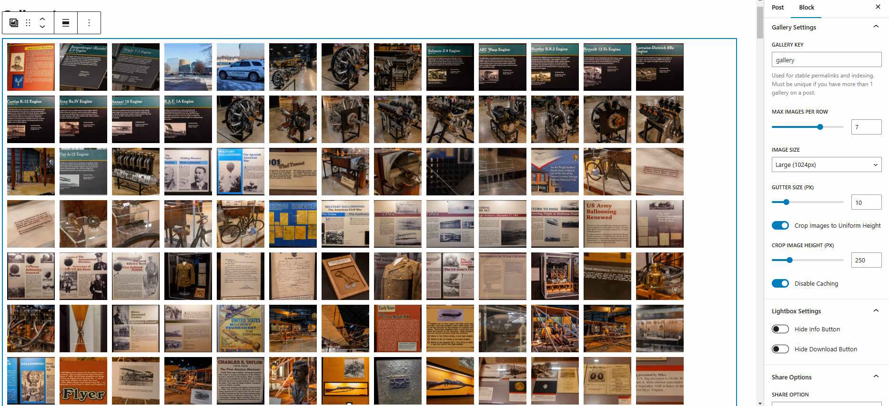
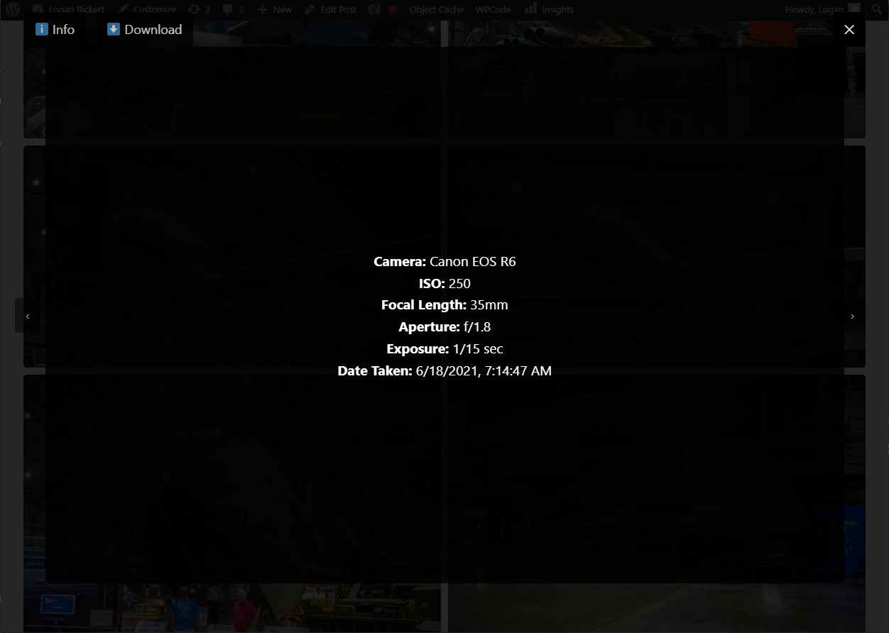
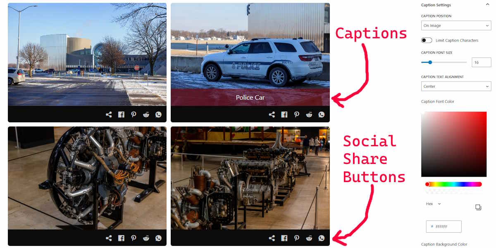

### 📖 **Infinity Gallery - A High-Performance WordPress Gallery Plugin**  

Infinity Gallery is a lightweight, high-performance WordPress gallery plugin designed for seamless image browsing. It supports infinite scrolling, dynamic image loading, mobile-friendly swipe gestures, a feature-rich lightbox, and optimized image selection for different screen sizes.  








---

## 🚀 **Features**  
- **Infinite Scrolling**: Dynamically loads images as the user scrolls.  
- **Optimized Image Loading**: Serves the best image size based on screen resolution.  
- **Mobile-Friendly**: Supports swipe gestures for navigating the lightbox.  
- **Lightbox with EXIF Metadata**: Displays EXIF metadata with a smooth flipping animation.  
- **Preload Next Image**: Ensures smooth transitions while browsing.  
- **Download & Info Buttons**: Allows users to download images and view metadata.  
- **Adjustable Gutter Size**: Customize spacing between images.  
- **Responsive Layout**: Adjusts the number of images per row dynamically.  
- **Gutenberg Block Support**: Easily add galleries via the WordPress block editor.  
- **Customizable Lightbox Controls**: Hide the **Info** and **Download** buttons via block settings.  
- **CSS Filters for Images**: Apply effects like **grayscale, sepia, blur, contrast, hue-rotate, and more** with adjustable strength.
- **Share Buttons**: Enable share button icons at the bottom of each image. Supports generic link copy, facebook post, Pinterest, Reddit, and WhatsApp.
- **Image Caption**: Enable viewing the caption of an image. It can be on top of the image at the bottom or directly below the image. The color of the text and background are both configurable and support transparency.
- **Caching**: Supports basic wordpress caching
- **Gallery Keyword**: Allows you to configure what the keyword for the gallery is when someone opens an image in the lightbox.
- **Configure On Click Action**: If you are not happy with a lightbox opening, you can change the settings to open in a new tab or do nothing.

---

## 📥 **Installation**  
### **1. Manual Installation:**  
- Download the latest version of **Infinity Gallery** from https://github.com/LoganRickert/infinity-gallery/releases
- Upload the plugin to `wp-content/plugins/`.  
- Extract and activate it from the **Plugins** menu.  

### **2. Automatic Installation:**  
- Go to **Plugins > Add New** in your WordPress dashboard.  
- Search for **Infinity Gallery**.  
- Click **Install Now** and then **Activate**.  

---

## 🛠 **Usage**  
### **Adding a Gallery (Gutenberg Block)**  
1. Open the WordPress **block editor**.  
2. Click **Add Block (+)** and search for **Infinity Gallery**.  
3. Click **Select Images** to choose images from your media library.  
4. Adjust **Max Images Per Row** to customize the layout.  
5. Set **Gutter Size** for spacing between images.  
6. Toggle **Lightbox Info & Download Buttons** on/off as needed.  
7. Choose an **Image Filter** and adjust strength if desired.  
8. Publish or update your post/page.  

### **Lightbox Navigation**  
- **Click an image** to open it in full-screen mode.  
- **Swipe left/right (mobile) or click Next/Prev** to navigate.  
- **Click "Info"** to flip the image and view metadata.  
- **Click "Download"** to save the image.  
- **Click outside the image or press "X"** to close the lightbox.  

---

## 🎨 **Image Filters**  
Infinity Gallery now supports **CSS filters**, allowing you to apply effects to all gallery images!  

| Filter Type | Description | Strength Range |
|------------|-------------|--------------|
| **None** | No filter applied | N/A |
| **Grayscale** | Converts image to grayscale | 0% - 100% |
| **Sepia** | Applies sepia tone | 0% - 100% |
| **Blur** | Softens image details | 0px - 50px |
| **Brightness** | Adjusts brightness | 0% - 100% |
| **Contrast** | Adjusts contrast levels | 0% - 100% |
| **Saturate** | Increases or decreases color saturation | 0% - 100% |
| **Invert** | Inverts colors | 0% - 100% |
| **Hue Rotate** | Rotates image colors | 0° - 360° |

🔹 **Lightbox images inherit the filter only if the gallery has a filter applied!**  

---

## 📐 **Responsive Layout**  

| Screen Width        | Images Per Row |
|--------------------|---------------|
| < 768px (Mobile)   | 1             |
| 768px - 1279px (Tablet) | 2         |
| 1280px - 1919px (1080p) | 3         |
| > 1920px (1440p+)  | 4+            |

🔹 **Supports up to 10 images per row with auto-scaling.**  

---

## 📦 **Packaging & Deployment**  
To generate a packaged version of the plugin for manual installation, run:  
```sh
npm run package
```
This creates a `dist/infinity-gallery.zip` file, ready for upload to another WordPress site.  

---

## 📜 **License**  
This plugin is licensed under the **GPL-2.0-or-later**.  

---

## 🙌 **Contributing**  
Feel free to submit **issues, feature requests, or pull requests** on the [GitHub repository](#).  

---

## 📝 **Changelog**

### 1.13.0

* Changed from Grid to Masonry for gallery.
* Lightbox IDs are now using Media ID to avoid loading wrong image if gallery order changes.

### 1.12.0

* Enqueue did not recursively check.

### 1.11.0

* Fixed dashicons not being loaded.
* Added extra aria labels.

### 1.10.0

* Switched to using blocks.json
* Added ability to customize the forced height of the images
* Added basic caching
* Added Share icons option. Can be configured to share the lightbox URL, the full width image, or the selected image size.
* Added ability to change on image click. You can now have it open a lightbox, open in a new tab, or do nothing.
* Added caption settings. It pulls from the Wordpress Caption field. You can limit the max number of characters if desired and you can customize the font size, text alignment, font color, and background color (including transparency).

### 1.9.0

* Refactored code

### 1.8.0
* Removed console logs
* Changed how downloading images worked.


### 1.7.0
* Refactored structure

### v1.6.0
* Fixed some potential security issues.

### v1.5.0
* Fixed touch screen issues with lightbox

### v1.4.0 
🔹 **New Features:**  
- **Hide Lightbox Buttons**: Option to hide the **Info** and **Download** buttons.  
- **CSS Image Filters**: Apply effects like **grayscale, blur, brightness, contrast, and hue-rotate**.  
- **Dynamically Adjustable Strength**: Filters adjust dynamically based on selection.  
- **Filters Apply to Lightbox**: Lightbox preview now inherits filters from its gallery.  
- **Performance Optimizations**: Improved lazy loading and reduced unnecessary image requests.  

### v1.0.0 (Initial Release)  
- Initial version with dynamic image loading, lightbox, swipe gestures, and optimized image selection.  

---

## 🔥 **Enjoy a Blazing Fast WordPress Gallery!**  
Infinity Gallery is built for **speed, performance, and usability**. 🎉 Try it today!

## Browserling Results for v1.11.0

- ✅ Chrome 137
- ✅ Chrome 122
- ✅ Chrome 83
- ✅ Chrome 66
- ❌ Chrome 65

- ✅ Edge 127
- ✅ Edge 100

- ✅ Firefox 128
- ✅ Firefox 105
- ✅ Firefox 87
- ✅ Firefox 61
- ❌ Firefox 60

- ✅ Opera 112
- ✅ Opera 68
- ✅ Opera 53
- ❌ Opera 52

- ✅ Brave 1.68
- ✅ Brave 1.24

- ✅ Vivaldi 6.8
